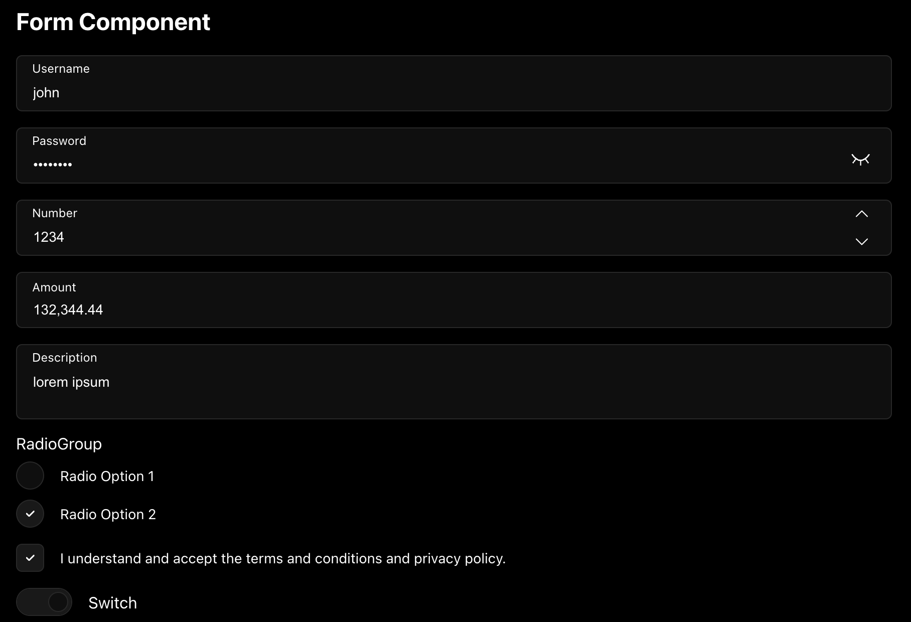
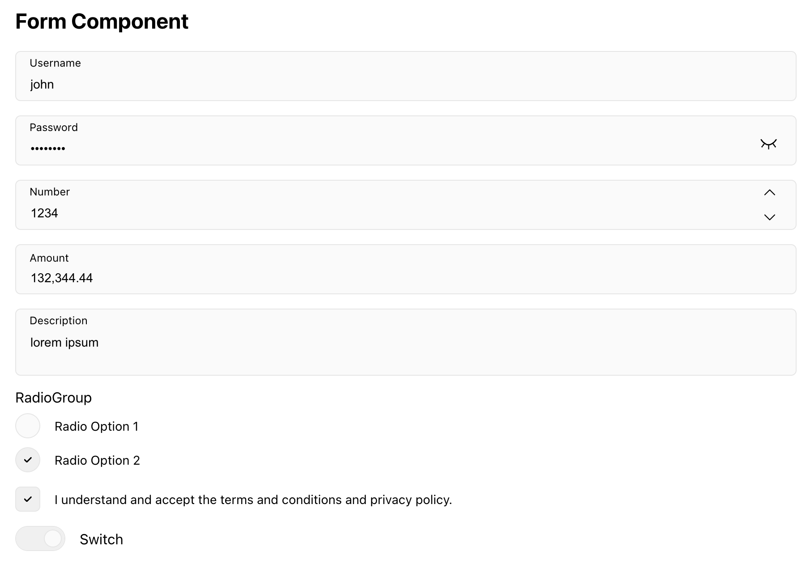
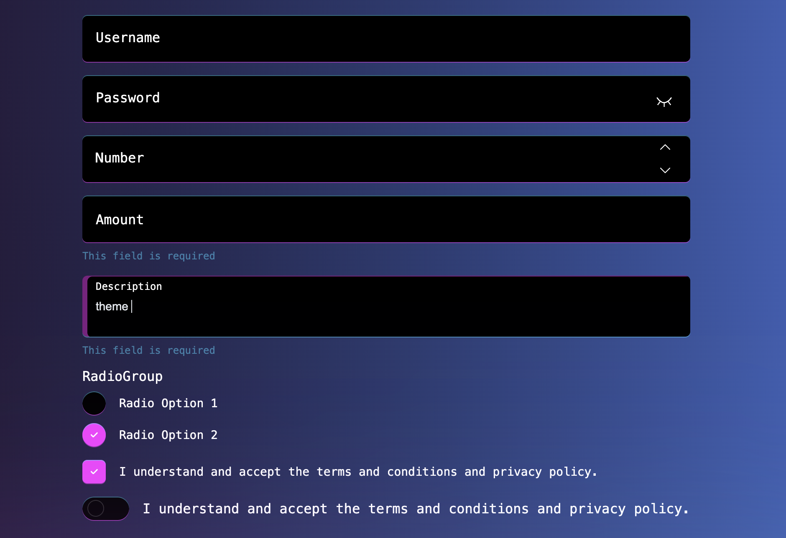
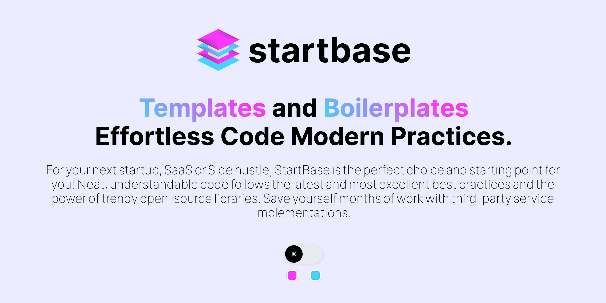

# @start-base/react-form-elements


## Demos

For live demos of these components in action, please visit our [Storybook](https://react-form-elements-eosin.vercel.app/), [react-hook-form](https://react-form-elements-eosin.vercel.app/?path=/story/form-form-reacthookform--form-component) and [react-hook-form-with-yup](https://react-form-elements-eosin.vercel.app/?path=/story/form-form-reacthookformyup--form-component) demo pages.

## Introduction

This npm package provides a set of form-related components for React. You can use these components to build forms with ease.

- CSS variables for theming are available for all components.
- Classnames are available for all components.
- Built-in dark mode support.





## Installation

To install, you can use [npm](https://npmjs.org/) or [yarn](https://yarnpkg.com):

```bash:Terminal
    $ npm install --save @start-base/react-form-elements
```

or

```bash:Terminal
    $ yarn add @start-base/react-form-elements
```

Make sure to add css file to your app root file

```jsx:layout.js
import '@start-base/react-form-elements/index.css';
```

## Usage

Each form element can be use separately. You can import them like this:

```jsx:Page.js
import Input from '@start-base/react-form-elements/Input';

const Page = () => {
  const [value, setValue] = useState('');

  const onChange = (e) => {
    const { name, value, type } = e.target;
    setValue(value);
  };

  return <Input name="name" label="Input" value={value} onChange={onChange} />;
};

export default Page;
```

or you can import all components from `@start-base/react-form-elements` like this:

```jsx:Page.js
import React, { useState } from 'react';
import {
  Input,
  Form,
  Checkbox,
  DatePicker,
} from '@start-base/react-form-elements';

const Page = () => {
  const [inputs, setInputs] = useState({});
  const onChange = (e) => {
    const { name, value, type } = e.target;

    setInputs((prevState) => ({
      ...prevState,
      [name]: type === 'checkbox' ? !prevState[name] : value,
    }));
  };

  return (
    <Form>
      <Input
        label="Username"
        name="username"
        value={inputs.username}
        onChange={onChange}
      />
      <Checkbox
        checked={inputs.agree}
        label="I understand and accept the terms and conditions and privacy policy."
        name="agree"
        onChange={onChange}
      />
      <DatePicker
        label="Date"
        name="date"
        value={inputs.date}
        onChange={onChange}
      />
    </Form>
  );
};

export default Page;
```

## Components

### AmountInput

### Calendar

### Checkbox

### CheckboxCards

### CheckboxGroup

### DatePicker

### DateRangePicker

### Form

### Input

### MultipleDatePicker

### NumberInput

### OTPInput

### PasswordInput

### PhoneInput

### Radio

### RadioCards

### RadioGroup

### Select

### Slider

### Switch

### TextArea

## API

The following props are available for each component:

### Common Props

| Name           | Type                              | Default | Description                                                                                                                                    |
| -------------- | --------------------------------- | ------- | ---------------------------------------------------------------------------------------------------------------------------------------------- |
| name           | `string`                          |         | Name of the input                                                                                                                              |
| label          | `string`                          | `null`  | Label of the input                                                                                                                             |
| placeholder    | `string`                          | `null`  | Placeholder of the input                                                                                                                       |
| disableShrink  | `boolean`                         | `false` | Position the label outside of the input                                                                                                        |
| value          | `string` or `number`              |         | Value of the input                                                                                                                             |
| onChange       | `function`                        |         | Callback function that is fired when the value changes.                                                                                        |
| inputClassName | `string`                          | `null`  | Classname for input element                                                                                                                    |
| labelClassName | `string`                          | `null`  | Classname for label element                                                                                                                    |
| errorClassName | `string`                          | `null`  | Classname for error element                                                                                                                    |
| disabled       | `boolean`                         | `false` | Disable the input                                                                                                                              |
| error          | `string` or `boolean` or `object` | `null`  | Error message to display below the input. if value is a boolean input border will be change. Also you can pass schema validator error objects. |

### AmountInput

This component is a wrapper around [react-currency-input-field](https://www.npmjs.com/package/react-currency-input-field) component. All props from react-currency-input-field can be passed to this component.

| Name             | Type                  | Default | Description                   |
| ---------------- | --------------------- | ------- | ----------------------------- |
| prepend          | `string` or `element` | `null`  | Prepend text to the input     |
| append           | `string` or `element` | `null`  | Append text to the input      |
| appendClassName  | `string`              | `null`  | Classname for append element  |
| prependClassName | `string`              | `null`  | Classname for prepend element |

### Calendar

This component is a wrapper around [react-day-picker](https://www.npmjs.com/package/react-day-picker) component. All props from react-day-picker can be passed to this component.

| Name              | Type     | Default | Description                    |
| ----------------- | -------- | ------- | ------------------------------ |
| calendarClassName | `string` | `null`  | Classname for calendar element |

### Checkbox

A basic checkbox input component.

| Name    | Type      | Default | Description                   |
| ------- | --------- | ------- | ----------------------------- |
| checked | `boolean` | `false` | Checked state of the checkbox |

### CheckboxCards

A card-style checkbox group component for enhanced visual presentation.

| Name                 | Type      | Default  | Description                         |
| -------------------- | --------- | -------- | ----------------------------------- |
| options              | `array`   | `[]`     | Array of options to display         |
| optionLabelClassName | `string`  | `null`   | Classname for option label          |
| cardClassName        | `string`  | `null`   | Classname for option card           |
| direction            | `string`  | `column` | Options direction `column` or `row` |
| hideInput            | `boolean` | `true`   | Input hide option                   |

### CheckboxGroup

A group of checkbox inputs managed together.

| Name                 | Type     | Default | Description                 |
| -------------------- | -------- | ------- | --------------------------- |
| options              | `array`  | `[]`    | Array of options to display |
| optionLabelClassName | `string` | `null`  | Classname for option label  |

### DatePicker

This component combined with Calendar component and Input component. All props from Calendar component and Input can be passed to this component.

| Name              | Type     | Default      | Description                    |
| ----------------- | -------- | ------------ | ------------------------------ |
| locale            | `object` | `null`       | date-fns locale object         |
| format            | `string` | `MM/dd/yyyy` | Date format                    |
| calendarClassName | `string` | `null`       | Classname for calendar element |

### DateRangePicker

This component combined with Calendar component and Select component. All props from Calendar component and Select can be passed to this component.

| Name              | Type      | Default      | Description                                 |
| ----------------- | --------- | ------------ | ------------------------------------------- |
| value             | `object`  | ` ""`        | to - from object                            |
| locale            | `object`  | `null`       | date-fns locale object                      |
| format            | `string`  | `MM/dd/yyyy` | Date format                                 |
| calendarClassName | `string`  | `null`       | Classname for calendar element              |
| numberOfMonths    | `number` | `2`          | Calender count to show date selection popup |
| separator         | `string`  | `" / "`      | Separator for dates on showing input        |

### Form

A wrapper component for form elements.

| Name     | Type        | Default | Description          |
| -------- | ----------- | ------- | -------------------- |
| children | `ReactNode` |         | Children of the form |

### Input

A basic input component with options for prepending and appending elements.

| Name             | Type                  | Default | Description                   |
| ---------------- | --------------------- | ------- | ----------------------------- |
| prepend          | `string` or `element` | `null`  | Prepend text to the input     |
| append           | `string` or `element` | `null`  | Append text to the input      |
| appendClassName  | `string`              | `null`  | Classname for append element  |
| prependClassName | `string`              | `null`  | Classname for prepend element |

### MultipleDatePicker

This component combined with Calendar component and Select component. All props from Calendar component and Select can be passed to this component.

| Name              | Type     | Default      | Description                       |
| ----------------- | -------- | ------------ | --------------------------------- |
| value             | `array`  | `[]`         | value array of MultipleDatePicker |
| locale            | `object` | `null`       | date-fns locale object            |
| format            | `string` | `MM/dd/yyyy` | Date format                       |
| calendarClassName | `string` | `null`       | Classname for calendar element    |

### NumberInput

A numeric input component with options for prepending and appending elements.

| Name             | Type                  | Default | Description                   |
| ---------------- | --------------------- | ------- | ----------------------------- |
| prepend          | `string` or `element` | `null`  | Prepend text to the input     |
| appendClassName  | `string`              | `null`  | Classname for append element  |
| prependClassName | `string`              | `null`  | Classname for prepend element |

### OTPInput

This component is a wrapper around [input-otp](https://www.npmjs.com/package/input-otp) component. All props from input-otp can be passed to this component.

| Name        | Type       | Default    | Description                                                                 |
| ----------- | ---------- | ---------- | --------------------------------------------------------------------------- |
| value       | `string`   |            | Value of the input                                                          |
| length      | `object`   |            | Length of the code.                                                         |
| timer       | `number`  | `null`     | OTP code timer limit of seconds.                                            |
| onComplete  | `function` |            | Callback function that is fired when the all values entered.                |
| onResend    | `function` |            | Callback function that is fired when the time out and cliced resend button. |
| format      | `array`    | `null`     | Inputs Separation array.                                                    |
| separator   | `string`   | `"-"`      | Separator element between inputs                                            |
| resendLabel | `string`   | `"Resend"` | Resend button text.                                                         |

### PasswordInput

A password input component with options for prepending and appending elements.

| Name             | Type                  | Default | Description                   |
| ---------------- | --------------------- | ------- | ----------------------------- |
| prepend          | `string` or `element` | `null`  | Prepend text to the input     |
| appendClassName  | `string`              | `null`  | Classname for append element  |
| prependClassName | `string`              | `null`  | Classname for prepend element |

### PhoneInput

This component is a wrapper around [react-international-phone](https://www.npmjs.com/package/react-international-phone) component. All props from react-international-phone can be passed to this component.

| Name           | Type     | Default | Description                                           |
| -------------- | -------- | ------- | ----------------------------------------------------- |
| defaultCountry | `string` | `us`    | Default country code for phone starting code and flag |

### Radio

A basic radio input component.

| Name    | Type      | Default | Description                |
| ------- | --------- | ------- | -------------------------- |
| checked | `boolean` | `false` | Checked state of the radio |

### RadioCards

A card-style radio group component for enhanced visual presentation.

| Name                 | Type      | Default  | Description                         |
| -------------------- | --------- | -------- | ----------------------------------- |
| options              | `array`   | `[]`     | Array of options to display         |
| optionLabelClassName | `string`  | `null`   | Classname for option label          |
| cardClassName        | `string`  | `null`   | Classname for option card           |
| direction            | `string`  | `column` | Options direction `column` or `row` |
| hideInput            | `boolean` | `true`   | Input hide option                   |

### RadioGroup

A group of radio inputs managed together.

| Name                 | Type     | Default | Description                 |
| -------------------- | -------- | ------- | --------------------------- |
| options              | `array`  | `[]`    | Array of options to display |
| optionLabelClassName | `string` | `null`  | Classname for option label  |

### Select

This component is a wrapper around [react-select](https://react-select.com/home) component. All props from react-select can be passed to this component.

| Name       | Type     | Default | Description                             |
| ---------- | -------- | ------- | --------------------------------------- |
| options    | `array`  | `[]`    | Array of options to display             |
| classNames | `object` | `null`  | ClassNames object for select components |
| components | `object` | `null`  | Components object for select            |

### Slider

This component is a wrapper around [rc-slider](https://slider-react-component.vercel.app/) component. All props from rc-slider can be passed to this component.

| Name    | Type      | Default | Description                       |
| ------- | --------- | ------- |-----------------------------------|
| min | `number` | `null`  | Min value of the slider           |
| max | `number` | `null`  | Max value of the slider           |
| step | `number` | `null`  | Step count of the handle movement |
| tracksClassName | `string` | `null`  | Classname for slider tracks       |
| trackClassName | `string` | `null`  | Classname for slider track        |
| railClassName | `string` | `null`  | Classname for slider rail         |
| handleClassName | `string` | `null`  | Classname for slider handle       |
| dotClassName | `string` | `null`  | Classname for slider dots         |

### Switch

A toggle switch component.

| Name    | Type      | Default | Description                 |
| ------- | --------- | ------- | --------------------------- |
| checked | `boolean` | `false` | Checked state of the switch |

### TextArea

A textarea component with optional auto-grow functionality.

| Name     | Type      | Default | Description        |
| -------- | --------- | ------- | ------------------ |
| autoGrow | `boolean` | `false` | Auto grow textarea |

## Styling

### With CSS variables

You can use CSS variables to customize the look and feel of the components. Here's a list of all available variables:

```css:global.css
--rfe-transparent: transparent;
--rfe-white: #fff;
--rfe-white-rgb: 255 255 255;
--rfe-black: #000;
--rfe-black-rgb: 0 0 0;
--rfe-color: #000;
--rfe-color-placeholder: #646464;
--rfe-color-error: #ff383e;
--rfe-border: #e6e6e6;
--rfe-background: #fafafa;
--rfe-background-selected: #f0f0f0;
--rfe-background-disabled: #e1e1e1;
--rfe-border-radius: 6px;
--rfe-font-size: 16px;
--rfe-placeholder-font-size: 14px;
--rfe-focused-font-size: 12px;
--rfe-error-font-size: 12px;
--rfe-input-height: 56px;
--rfe-spacing: 16px;
--rfe-label-spacing: 10px;
--rfe-focus: 0 0 10px #dcdcdc;
--rfe-font-family: 'Arial', sans-serif;
```

### With classnames

You can use classnames to customize the look and feel of the components. Here's an example of how to use classnames:

```css:CustomInput.module.scss
.input {
  &:focus {
  }
}

.label {
}

.errorLabel {
}
```

```jsx:CustomInput.js
import { forwardRef } from 'react';

import Input from '@start-base/react-form-elements/Input';

import styles from './CustomInput.module.scss';

const CustomInput = forwardRef((props, ref) => (
  <Input
    ref={ref}
    {...props}
    inputClassName={styles.input}
    labelClassName={styles.label}
    errorClassName={styles.errorLabel}
  />
));

export default CustomInput;
```

## Examples

For more examples, please visit our [CodeSandbox](https://codesandbox.io/p/sandbox/inspiring-jepsen-wnr5tg) and [Storybook](https://react-form-elements-eosin.vercel.app/) demo pages.

### react-hook-form

Here's an example of using the form elements with [react-hook-form](https://react-hook-form.com/):

```jsx:Page.js
import React, { useState } from 'react';
import { useForm, Controller } from 'react-hook-form';
import {
  Input,
  Form,
  Checkbox,
  DatePicker,
} from '@start-base/react-form-elements';

const Page = () => {
  const [inputs, setInputs] = useState({});
  const { control, register, handleSubmit, watch } = useForm();
  const onSubmit = (data) => setInputs(data);

  return (
    <Form>
      <Input
        label="Username"
        value={watch('username')}
        {...register('username')}
      />
      <Checkbox
        label="I understand and accept the terms and conditions and privacy policy."
        checked={watch('policy')}
        {...register('policy')}
      />
      <Controller
        name="date"
        control={control}
        render={({ field }) => (
          <DatePicker label="Date" value={watch('date')} {...field} />
        )}
      />
      <button onClick={handleSubmit(onSubmit)}>Submit</button>
    </Form>
  );
};

export default Page;
```

### react-hook-form with yup

Here's an example of using the form elements with [react-hook-form](https://react-hook-form.com/) and [yup](https://www.npmjs.com/package/yup):

```jsx:Page.js
import React, { useState } from 'react';
import { useForm, Controller } from 'react-hook-form';
import {
  Input,
  Form,
  Checkbox,
  DatePicker,
} from '@start-base/react-form-elements';
import { yupResolver } from '@hookform/resolvers/yup';
import * as yup from 'yup';

const validationSchema = yup.object({
  username: yup.string().required('Required').label('Username'),
  date: yup.date().required('Required').label('Date'),
  policy: yup.boolean().required('Required').label('Policy'),
});

const Page = () => {
  const [inputs, setInputs] = useState({});
  const {
    formState: { errors },
    control,
    register,
    handleSubmit,
    watch,
  } = useForm({
    resolver: yupResolver(validationSchema),
  });
  const onSubmit = (data) => setInputs(data);

  return (
    <Form>
      <Input
        label="Username"
        value={watch('username')}
        {...register('username')}
        error={errors.username}
      />
      <Checkbox
        label="I understand and accept the terms and conditions and privacy policy."
        checked={watch('policy')}
        {...register('policy')}
        error={errors.policy}
      />
      <Controller
        name="date"
        control={control}
        render={({ field }) => (
          <DatePicker
            label="Date"
            value={watch('date')}
            error={errors.date}
            {...field}
          />
        )}
      />
      <button onClick={handleSubmit(onSubmit)}>Submit</button>
    </Form>
  );
};

export default Page;
```

## Demos

For live demos of these components in action, please visit our [Storybook](https://react-form-elements-eosin.vercel.app/), [react-hook-form](https://react-form-elements-eosin.vercel.app/?path=/story/form-form-reacthookform--form-component) and [react-hook-form-with-yup](https://react-form-elements-eosin.vercel.app/?path=/story/form-form-reacthookformyup--form-component) demo pages.


<br />

<div align="center">
<a href="https://startbase.dev/oss/react-form-elements">Website</a> 
<span> · </span>
<a href="https://www.npmjs.com/search?q=%40start-base">Npm</a> 
<span> · </span>
<a href="https://twitter.com/start_base_dev">Twitter</a>
</div>

<br />
<div align="center">
  <sub>Developed by <a href="https://startbase.dev">Startbase</a> 🧑‍💻</sub>
</div>

<br />
