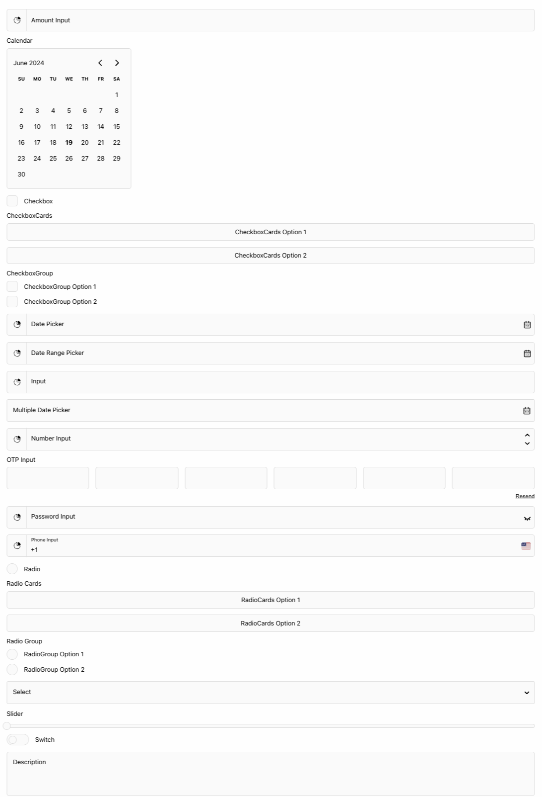

<p align="center">
  <a href="https://startbase.dev" target="_blank">
    
  </a>
</p>

<h1 align="center">@start-base/react-form-elements</h1>

<p align="center">
  Unlock a robust collection of form-focused React components, thoughtfully crafted for maximum ease of use and flexibility. Built with Next.js compatibility, these components streamline the website development process, enhancing efficiency and empowering you to create custom, user-friendly forms effortlessly.
</p>

<p align="center">
  <a href="https://github.com/startbase-dev/react-form-elements/blob/main/LICENSE" target="_blank"></a>
  <a href="https://npmjs.com/package/@start-base/react-form-elements" target="_blank"></a>
  <a href="https://npmjs.com/package/@start-base/react-form-elements" target="_blank"></a>
  <a href="https://npmjs.com/package/@start-base/react-form-elements" target="_blank"></a>
</p>

---



## Documentation

For full documentation, please visit [start-ui.startbase.dev](https://start-ui.startbase.dev/docs).

## Installation

To install, you can use [npm](https://npmjs.org) or [yarn](https://yarnpkg.com):

```bash title='Terminal'
$ npm install @start-base/react-form-elements
# or
$ yarn add @start-base/react-form-elements
```

Make sure to import `styles.css` to your app root:

```tsx
import '@start-base/react-form-elements/styles.css';
```

## Features

- CSS variables for theming.
- Classnames for fine tuning.
- Built-in dark mode support.
- Variants for different styles.

## Styling

### With CSS Variables

You can use CSS variables to customize the look and feel of the components. Here's a list of all available variables:

```css title="global.css"
--rfe-transparent: transparent;
--rfe-white: #fff;
--rfe-white-rgb: 255 255 255;
--rfe-black: #000;
--rfe-black-rgb: 0 0 0;
--rfe-color: #000;
--rfe-color-placeholder: #646464;
--rfe-color-error: #ff383e;
--rfe-border: #e6e6e6;
--rfe-background: #fafafa;
--rfe-background-selected: #f0f0f0;
--rfe-background-disabled: #e1e1e1;
--rfe-border-radius: 6px;
--rfe-font-size: 16px;
--rfe-placeholder-font-size: 14px;
--rfe-focused-font-size: 12px;
--rfe-error-font-size: 12px;
--rfe-input-height: 56px;
--rfe-spacing: 16px;
--rfe-label-spacing: 10px;
--rfe-focus: 0 0 10px #dcdcdc;
--rfe-font-family: 'Arial', sans-serif;
```

### With Classnames

You can use classnames to customize the look and feel of the components. Here's an example of how to use classnames:

```css title="CustomInput.module.scss"
.input {
  &:focus {
  }
}

.label {
}
```

```jsx title="CustomInput.js"
import { forwardRef } from 'react';

import Input from '@start-base/react-form-elements/Input';

import styles from './CustomInput.module.scss';

const CustomInput = forwardRef((props, ref) => (
  <Input
    ref={ref}
    {...props}
    inputClassName={styles.input}
    labelClassName={styles.label}
    errorClassName={styles.errorLabel}
  />
));

export default CustomInput;
```

Or for all form elements you can use single css file.

```css title="FormElements.module.scss"
.input {
  &:focus {
  }
}

.inputFocused {
}
```

## Demos

For live demos, please visit our [Storybook](https://react-form-elements-eosin.vercel.app/) page.

## Contributing

Contributions are welcomed. Feel free to submit pull requests and improvements to the project!

<table>
  <tr>
    <td align="center">
      <br />
      <sub>
        <a href="https://github.com/yunusozcan">yunusozcan</a>
      </sub>
    </td>
    <td align="center">
      <br />
      <sub>
        <a href="https://github.com/emreonursoy">emreonursoy</a>
      </sub>
    </td>
  </tr>
</table>
